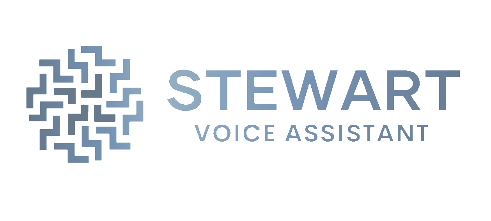

<br />
<div align="center">
  <a href="https://github.com/ilyamiro/Stewart">
    
  </a>
<h1 align="center">STEWART</h1>
  <p align="center">
    Your personal voice assistant
    <br />
    <a href="https://github.com/ilyamiro/Stewart"><strong>Explore the docs »</strong></a>
    <br />
</div>

<h3>Version: NONE (still in progress) <br>Author: ilyamiro<br>Telegram: <a href="https://t.me/stewart_developer">@stewart</a></h3>

<!-- TABLE OF CONTENTS -->
<details>
  <summary>Table of Contents</summary>
  <ol>
    <li>
      <a href="#about-the-project">About The Project</a>
    </li>
    <li><a href="#getting-started">Getting Started</a>
      <ul>
        <li><a href="#installation">Installation (does not work yet)</a></li>
        <li><a href="#installation">Linux test version</a></li>
      </ul>
    <li> <a href="#lisence">License</a>
    </li>
  </ol>
</details>

## About the project
Stewart is a very useful voice assistant with a voice 
synthesizer provided by <a href="https://github.com/snakers4/silero-models">silero(v4)</a>
and a speech-recognition vosk models taken from <a href="https://alphacephei.com/vosk/models">there</a> <br>

Stewart uses GPT 3.5 models for question answering. <br>


## Getting Started
For deployment, you have to install python 3.11.6 from <a href="https://www.python.org/downloads/release/python-3116/">python.org</a> or use package manager on linux system.

### Installation
<strong>WARNING: the project is not finished</strong>
1. Clone repository:
  ```
  git clone https://github.com/ilyamiro/Stewart.git
  ```
2. Enter it:
  ```
  cd Stewart
  ```
3. Install requirements txt:
  ```
  python3.11 -m pip install -r requirements.txt
  ```
4. Launch gui.py using python: <br>
- Linux:
 
```
python3.11 GUI/console_gui.py
  ```
- On Windows:
```
DOES NOT WORK ON WINDOWS NOW
  ```
<strong>Enjoy :)</strong>


Further documentation will appear here after release.


## Lisence


<strong>Copyright --- 2023 --- <i>Miro Ilya</i></strong> ©

Licensed under the Apache License, Version 2.0 (the "License");
you may not use this file except in compliance with the License.

You may obtain a copy of the License at

   http://www.apache.org/licenses/LICENSE-2.0

Unless required by applicable law or agreed to in writing,
software distributed under the License is distributed on an "AS IS" BASIS, WITHOUT WARRANTIES OR CONDITIONS OF ANY KIND, either express or implied.
See the License for the specific language governing permissions and limitations under the License.


