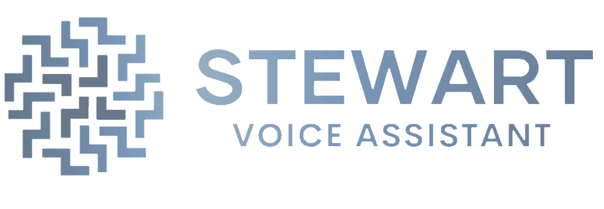

<div align="center">
    
    <h1>🖥️Stewart</h1>
</div>

> Полезный и расширяемый голосовой помощник

[](https://github.com/ilyamiro/Stewart/releases/latest) [](https://github.com/ilyamiro/Stewart/master/LICENSE)

<a id="link-wiki" href="https://github.com/ilyamiro/Stewart/wiki"><strong>📘Исследовать вики</strong></a>
<h3>**ПРЕДУПРЕЖДЕНИЕ**: проект еще не завершен и не работает должным образом</h3>

## 🚩 Содержание

- [О проекте](#About)
- [Установка](#installation)
- [Лицензия](#license)

### О проекте

Вы можете прочитать о **Stewart** в нашем <a href=https://github.com/ilyamiro/Stewart/wiki>**вики!**</a>

### Установка

Для развертывания вам необходимо установить python 3.11 с <a href="https://www.python.org/downloads/release/python-3116/">python.org</a>,
если вы работаете в **Windows** (пока что не поддерживается) или используйте менеджер пакетов на **Linux** 

1. Клонируйте репозиторий и установите зависимости:
  ```commandline
  git clone https://github.com/ilyamiro/Stewart.git
  cd Stewart
  python3.11 -m pip install -r requirements.txt
  ```
2. Запустите main.py и дождитесь, пока голосовой помощник начнет работу:<br>
- **Linux**:
```commandline
python3.11 main.py
```

- Пока что не работает в **Windows**

**Наслаждайтесь!**

### Лицензия

Copyright - **2024** - <i>Miro Ilya</i> ©

Лицензирован в соответствии с лицензией Apache License, Version 2.0 (the "License");
вам не разрешается использовать этот файл в противоречии с Лицензией.

Вы можете получить копию Лицензии по адресу

   http://www.apache.org/licenses/LICENSE-2.0

Если не требуется соответствующее законодательство или соглашение в письменной форме,
программное обеспечение, распространяемое в соответствии с Лицензией, распространяется "КАК ЕСТЬ", БЕЗ КАКИХ-ЛИБО ГАРАНТИЙ ИЛИ УСЛОВИЙ ЛЮБОГО РОДА, явно выраженных или подразумеваемых.
См. Лицензию для конкретного языка, регулирующего разрешения и ограничения в соответствии с Лицензией.